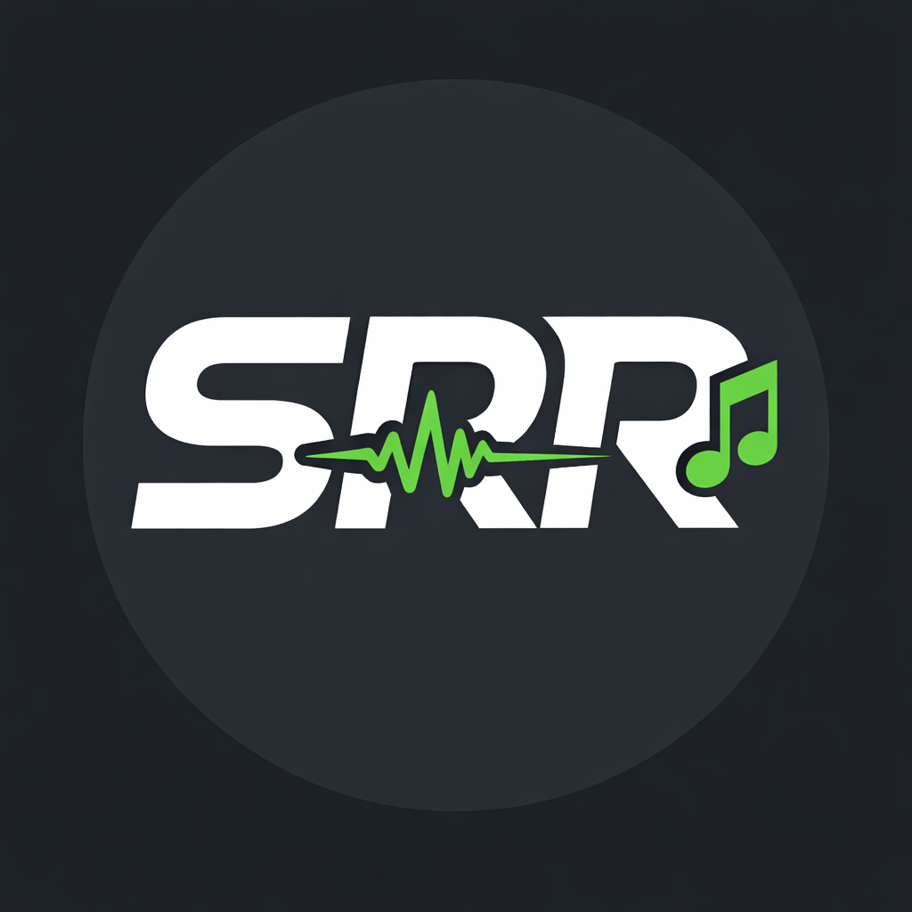

<p align="center">
  
</p>

<h1 align="center">SRR Salsero</h1>

<p align="center">A Discord music bot that plays music from YouTube, Spotify, and SoundCloud in voice channels.</p>

## Features

- Play music from **YouTube**, **Spotify**, and **SoundCloud**
- Search by URL or keywords
- Queue management with shuffle, loop, and remove
- Interactive buttons on Now Playing messages (pause, skip, stop, loop, shuffle)
- Volume control and seek

## Prerequisites

- **Node.js 22+** (use `nvm use` to switch — `.nvmrc` is included)
- **FFmpeg** (bundled via `ffmpeg-static`, no install needed)

## Setup

### 1. Create a Discord Bot

1. Go to the [Discord Developer Portal](https://discord.com/developers/applications)
2. Click **New Application**, give it a name, and click **Create**
3. Go to the **Bot** tab on the left sidebar
4. Click **Reset Token** and copy your bot token — save it somewhere safe
5. Scroll down to **Privileged Gateway Intents** and enable **Server Members Intent** (optional) — you do NOT need Message Content Intent since we use slash commands
6. Go to the **OAuth2** tab
7. Under **OAuth2 URL Generator**, check these scopes: `bot`, `applications.commands`
8. Under **Bot Permissions**, check: `Connect`, `Speak`, `Send Messages`, `Embed Links`, `Read Message History`
9. Copy the generated URL at the bottom and open it in your browser to invite the bot to your server

### 2. Create a Spotify App (optional, for Spotify link support)

1. Go to the [Spotify Developer Dashboard](https://developer.spotify.com/dashboard)
2. Click **Create App**
3. Give it a name and description, set the redirect URI to `http://localhost` (not used, but required)
4. Copy the **Client ID** and **Client Secret**

### 3. Configure Environment Variables

```bash
cp .env.example .env
```

Edit `.env` and fill in your values:

```
DISCORD_TOKEN=your_bot_token_here
DISCORD_CLIENT_ID=your_bot_client_id_here
GUILD_ID=your_discord_server_id_here
SPOTIFY_CLIENT_ID=your_spotify_client_id_here
SPOTIFY_CLIENT_SECRET=your_spotify_client_secret_here
```

**How to get your Guild ID:** Right-click your Discord server name > Copy Server ID (you need Developer Mode enabled in Discord settings > Advanced).

**How to get your Client ID:** It's on the **OAuth2** page (or General Information page) of your Discord application.

### 4. Install Dependencies

```bash
nvm use
npm install
```

### 5. Register Slash Commands

```bash
npm run deploy
```

This registers the bot's slash commands with Discord. If you set `GUILD_ID`, commands appear instantly in that server. Without it, they register globally (takes up to 1 hour).

### 6. Start the Bot

```bash
npm start
```

## Commands

| Command | Description |
|---------|-------------|
| `/play <query>` | Play a song (URL or search keywords) |
| `/pause` | Pause the current song |
| `/resume` | Resume playback |
| `/skip` | Skip to the next song |
| `/stop` | Stop playback and clear the queue |
| `/queue` | Show the current queue |
| `/nowplaying` | Show the current song with a progress bar |
| `/volume <1-100>` | Set the volume |
| `/loop <off\|song\|queue>` | Set the loop mode |
| `/shuffle` | Shuffle the queue |
| `/remove <position>` | Remove a song from the queue |
| `/seek <seconds>` | Seek to a position in the current song |

## Supported Sources

- **YouTube** — URLs and keyword search
- **Spotify** — Track, album, and playlist URLs (audio streams from YouTube)
- **SoundCloud** — Track and playlist URLs
